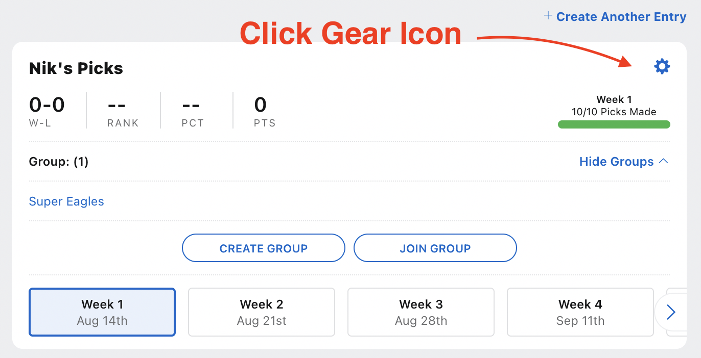
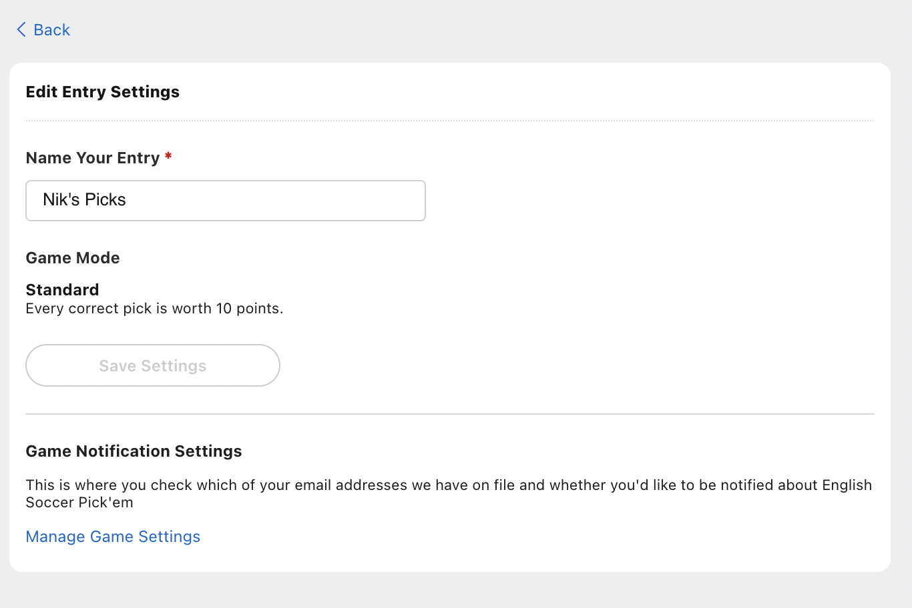

import ButtonLink from "../../../src/components/ButtonLink"

## Overview

 * EPL tipping comp for the 2021-22 season
 * Runs on ESPN website
 * **$100** entry for year
 * Payout top 3 finishes

## Payout

Pays out at conclusion of season

  * **1st place** - 50% of pool
  * **2nd place** - 30% of pool
  * **3rd place** - 20% of pool

## Entry

 &nbsp; 

<ButtonLink link="https://fantasy.espn.com.au/games/english-premier-league-pickem-2021/group?id=dad4c8b2-de3a-46a4-b825-92d0e3f6926b&joining=true&joinKey=423555df-d919-3e97-baf6-c32cdb9be823">Click Here To Go to the ESPN website and signup for the pool</ButtonLink>

 &nbsp; 

Group name is `Super Eagles`

Group password is `dapto2530`

## Change Entry Name

By default the ESPN site gives you an entry name that is a random string. Change it to your name or a nickname by clicking on the gear icon in the top-right corner, setting your entry name and then saving:

**Step 1**

Click the gear icon in the top-right.

**Step 2**

Change the name of your entry to your name and save settings.

## Payment

Will sort out entry payments after week 1 as a separate bank account and PayID etc. will be setup.
