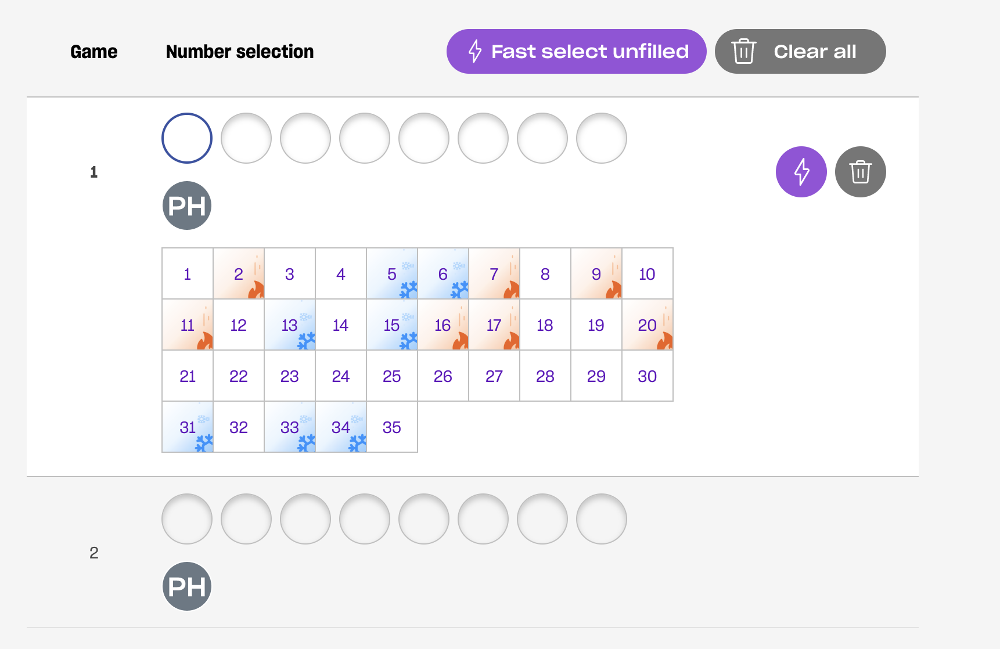

## Overview

 * One off game for the $80 million Powerball draw on teh 12th of August 2021
 * Continue syndicate starting 17th of August 2021 (details to come)
 * Syndicate of 10 shares

## $80 million Powerball Jackpot game

 * Draw details for [$80 million Powerball draw are on the lott website](https://www.thelott.com/powerball/play?jid=weekly-offers-powerball)
 * Play 2x Powerhit systems 8 games
    - PowerHit means the powerball number is boxed
    - System 8 means pick 8 numbers per game total
    - Jackpot is 7 numbers plus Powerball
    - Payouts start at 2 numbers plus Powerball
  * **$194.15** per PowerHit Systems 8 game
  * Total entry price of 2 games is **$388.30**
  * 10 entries in Syndicate means cost per share is **$38.30**

## Numbers Selected

Have 16 numbers to select for both entries in total.

Number allocation TBD

Here is the lotto site showing hot and cold numbers for anyone who believes in that nonsense

## Deposit

Please send in **$38.30** via either PayID, Osko or PayPal below.

### 1. Deposit with PayID (Preferred)

PayID an amount to email `lotto@nikcub.me` and please include your name in the payment description.

### 2. Deposit with Osko / Account Details

Syndicate bank account details are:

| Field | Value |
|:--|:--|
| Bank | NAB |
| Bank Branch | Shellharbour |
| | Shop 45A, Stockland Shellharbour Sc |
| | Lake Entrance Rd, Shellharbour NSW 2529|
| Account Name | N Cubrilovic |
| BSB | 082-812 |
| Account Number | 809693745 |

### 3. Deposit With PayPal

Either visit [paypal.me/juicybanger](https://paypal.me/juicybanger)

Click through here and send an amount:

<form action="https://www.paypal.com/donate" method="post" target="_top">
<input type="hidden" name="business" value="MY98UPZ2KBRBE" />
<input type="hidden" name="no_recurring" value="1" />
<input type="hidden" name="item_name" value="Games night pool" />
<input type="hidden" name="currency_code" value="AUD" />
<input type="image" src="https://www.paypalobjects.com/en_AU/i/btn/btn_donateCC_LG.gif" border="0" name="submit" title="PayPal - The safer, easier way to pay online!" alt="Donate with PayPal button" />

</form>

Scan this QR code on your phone:

