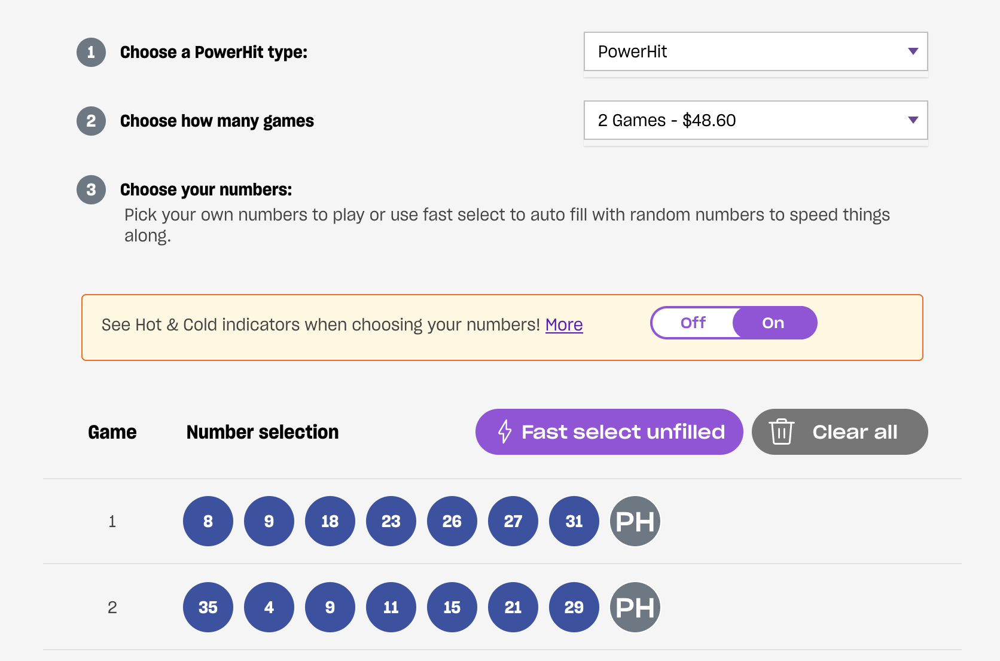

import ButtonLink from "../../../src/components/ButtonLink"

## Overview

 * Two games of Powerhit per week
 * Starting `4th November 2021`
 * 10 spots
 * `$48.60` per week
 * Run for a year
 * If the returns are less than entry let it run

## Entry

## Costs

 * `$48.60` per week
 * 1 year = `$2527.20`
 * Per entrant = `$252.72`

## Deposit

Please send in **$252.72** via either PayID, Osko or PayPal below.

### 1. Deposit with PayID (Preferred)

PayID amount to email `lotto@nikcub.me` and please include your name in the payment description.

### 2. Deposit With PayPal

Either visit [paypal.me/juicybanger](https://paypal.me/juicybanger)

Click through here and send an amount:

<form action="https://www.paypal.com/donate" method="post" target="_top">
<input type="hidden" name="business" value="MY98UPZ2KBRBE" />
<input type="hidden" name="no_recurring" value="1" />
<input type="hidden" name="item_name" value="Games night pool" />
<input type="hidden" name="currency_code" value="AUD" />
<input type="image" src="https://www.paypalobjects.com/en_AU/i/btn/btn_donateCC_LG.gif" border="0" name="submit" title="PayPal - The safer, easier way to pay online!" alt="Donate with PayPal button" />

</form>

Scan this QR code on your phone:

