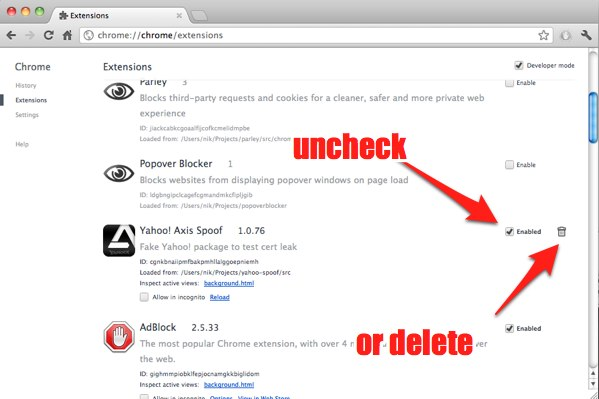

Yahoo! today announced their new [Axis](http://axis.yahoo.com) web browser. It is implemented as an extension to Chrome, Firefox and Internet Explorer.

I installed the [Chrome extension](http://sxp.yimg.com/ei/ynano/YAxis_Chrome_v1_0_20120520.crx) (direct link to original Chrome extension, probably not a good idea to install it) with the idea of checking out the source code. The first thing I noticed is that the source package contains their private certificate file used to sign the extension:

The certificate file is used by Yahoo! to sign the extension package, which is used by Chrome and the webstore to authenticate that the package comes from Yahoo!. With access to the private certificate file a malicious attacker is able to create a forged extension that Chrome will authenticate as being from Yahoo!

### Demonstration

To demonstrate the vulnerability, I cloned the source to the extension and added a content script that will prompt a Javascript alert. I then signed my forged extension with the Yahoo! certificate, and installed it in Chrome.

The code for the original Yahoo! extension, and the forged extension I created have been checked into GitHub in a repository at [http://github.com/nikcub/yahoo-spoof](http://github.com/nikcub/yahoo-spoof)

The source is the same as the original Yahoo! Axis extension except for [this content script](https://github.com/nikcub/yahoo-spoof/blob/master/src/content.js#L2) which triggers an alert.

**Warning: Only install the forged extension if you know what you are doing**

Here is [a link](https://github.com/nikcub/yahoo-spoof/raw/master/build/yahoo-spoof.crx) to a build of the forged extension. It is the same as the original Yahoo! source except it includes a content script that will popup a javascript alert on each page, and it has been signed by Yahoo! (well, me).

This is a proof of concept. When you click on that link it will install the extension in Chrome.

### Removing the Extension

See the [detailed instructions on the Google Support website on managing extensions](http://support.google.com/chrome/bin/answer.py?hl=en&amp;answer=187443). There is also a page detailing [how to remove extensions permanently](http://support.google.com/chrome/bin/answer.py?hl=en&amp;answer=113907).

First open the Chrome Extensions setting window.

Either:

a) On Mac OS X click on 'Window' and then 'Extensions'. On Windows click on 'Tools' then 'Extensions', or

b) Click on the wrench icon that is located to the right-hand side of the address bar, click on Tools and then Extensions

c) Visit the address `chrome://extensions` in your address bar. This works on all platforms

Then when you have the extensions setting page open. scroll down until you see the `Yahoo! Axis` extension and either uncheck the 'enabled' checkbox, or mouse over the trash icon to delete it.

### Implications

The clearest implication is that with the private certificate file and a fake extension you can create a spoofed package that captures all web traffic, including passwords, session cookies, etc. The easiest way to get this installed onto a victims machine would be to DNS spoof the update URL. The next time the extension attempts to update it will silently install and run the spoofed extension.

I immediately reported this to Yahoo! on their security contact address and have yet to hear back.

**Update:** Regarding responsible disclosure. I have a long history of contacting vendors and working with them on security and privacy leaks. I have probably reported over a hundred incidents over the past 15 years. The way this came about was out in the open, and started [with tweet](https://twitter.com/nikcub/status/205489752684765185) pointing out the file and only later in the conversation was the possible seriousness of the leak established.

It was only via conversations and messages on Twitter after the initial tweet that we worked out that this could be a serious issue, but I contacted Yahoo almost right away. I think it is important for users to know that there is potentially an issue here and to be wary of it. With hindsight I would have kept it to myself and messages Twitter, but I relied on a number of other people on Twitter who responded to my original message to ascertain the potential of this disclosure.

There is also an element of obviousness in this vulnerability. Any developer who is familiar with how Chrome extensions are verified who looked at the source of this package would have seen and noticed the certificate file.

